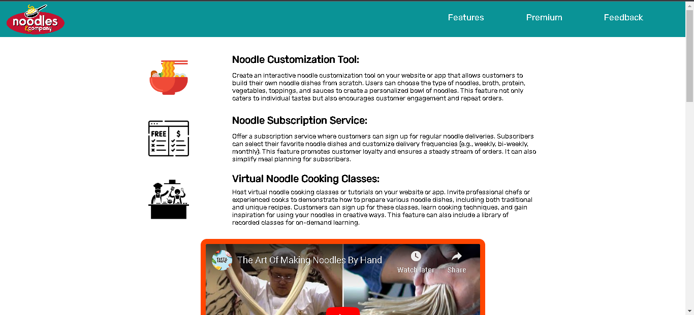
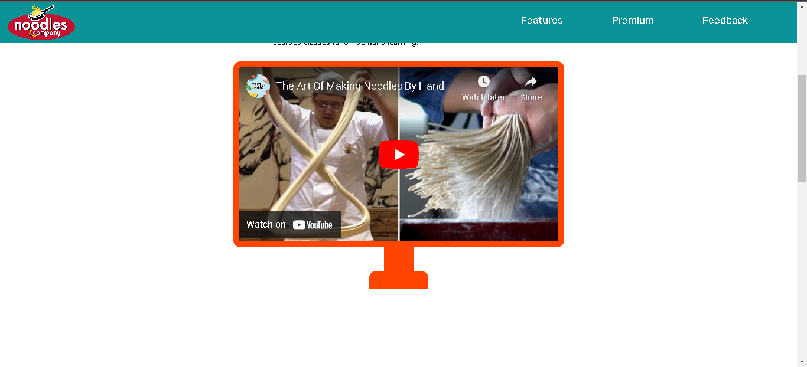
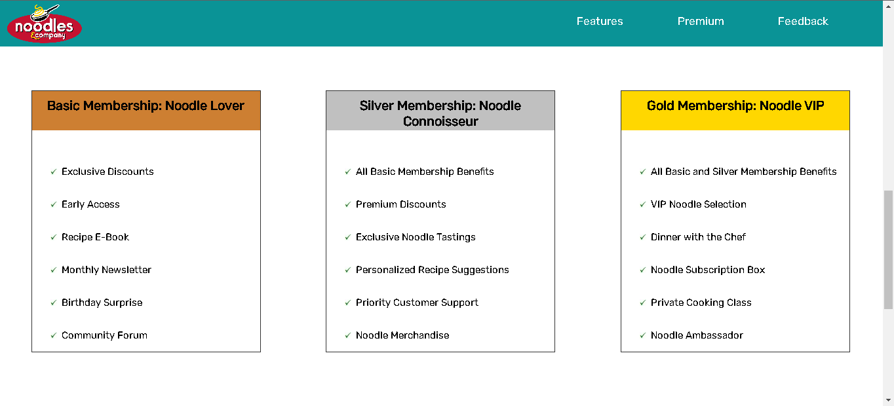
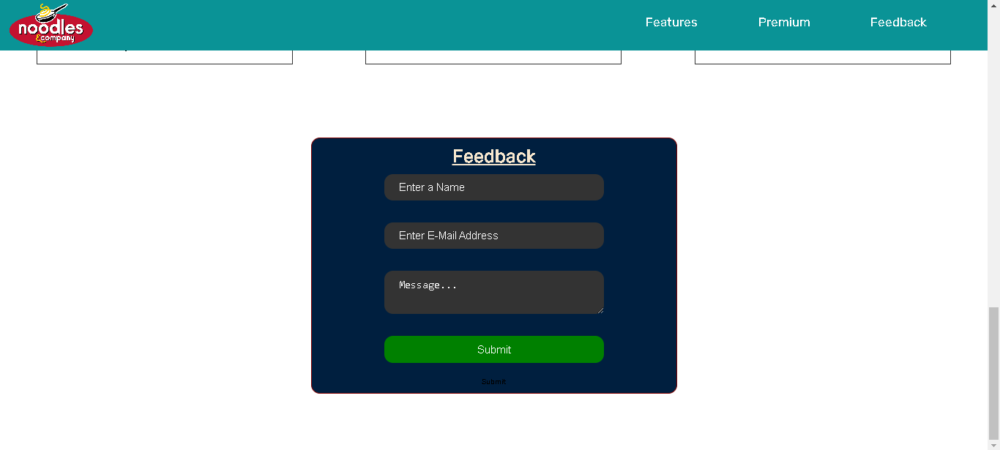

# Product Landing Page






## Table of Contents

- [About](#about)
- [Features](#features)
- [Membership](#membership)
- [Feedback](#feedback)
- [Getting Started](#getting-started)
- [Usage](#usage)
- [Contributing](#contributing)
- [License](#license)

## About

This is a product landing page project for a fictional noodle company. The landing page is designed to showcase the company's features, subscription services, and membership options.

The project includes HTML and CSS code for creating a responsive and visually appealing landing page.

## Features

- **Noodle Customization Tool:** Allow customers to build their own personalized noodle dishes.
- **Noodle Subscription Service:** Offer subscription options for regular noodle deliveries.
- **Virtual Noodle Cooking Classes:** Host virtual cooking classes to engage and educate customers.
- **Responsive Design:** The page is designed to work well on various screen sizes.

## Membership

The landing page also highlights different membership tiers:

- **Basic Membership: Noodle Lover**
  - Exclusive Discounts
  - Early Access
  - Recipe E-Book
  - Monthly Newsletter
  - Birthday Surprise
  - Community Forum

- **Silver Membership: Noodle Connoisseur**
  - All Basic Membership Benefits
  - Premium Discounts
  - Exclusive Noodle Tastings
  - Personalized Recipe Suggestions
  - Priority Customer Support
  - Noodle Merchandise

- **Gold Membership: Noodle VIP**
  - All Basic and Silver Membership Benefits
  - VIP Noodle Selection
  - Dinner with the Chef
  - Noodle Subscription Box
  - Private Cooking Class
  - Noodle Ambassador

## Feedback

We value your feedback! If you have any questions, suggestions, or comments, please feel free to reach out to us. You can use the feedback form provided on the landing page.

## Getting Started

To get started with this project, follow these steps:

1. Clone this repository to your local machine:

   ```bash
   git clone https://github.com/CodeMegan27/Product-Landing-Page.git
   ```
2. Open the project in your preferred code editor.

3. Explore and modify the HTML and CSS files to customize the landing page according to your needs.

## Usage

You can use this landing page template as a starting point for showcasing your own products or services. Customize the content, images, and styles to match your brand and offerings.

## Contributing

Contributions are welcome! If you have any improvements or suggestions for this project, please submit a pull request. Feel free to report any issues as well.

